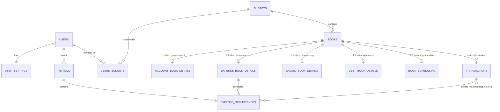
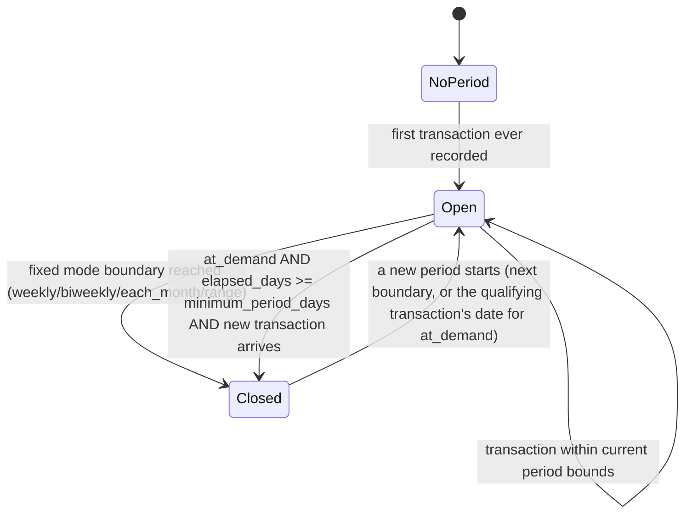
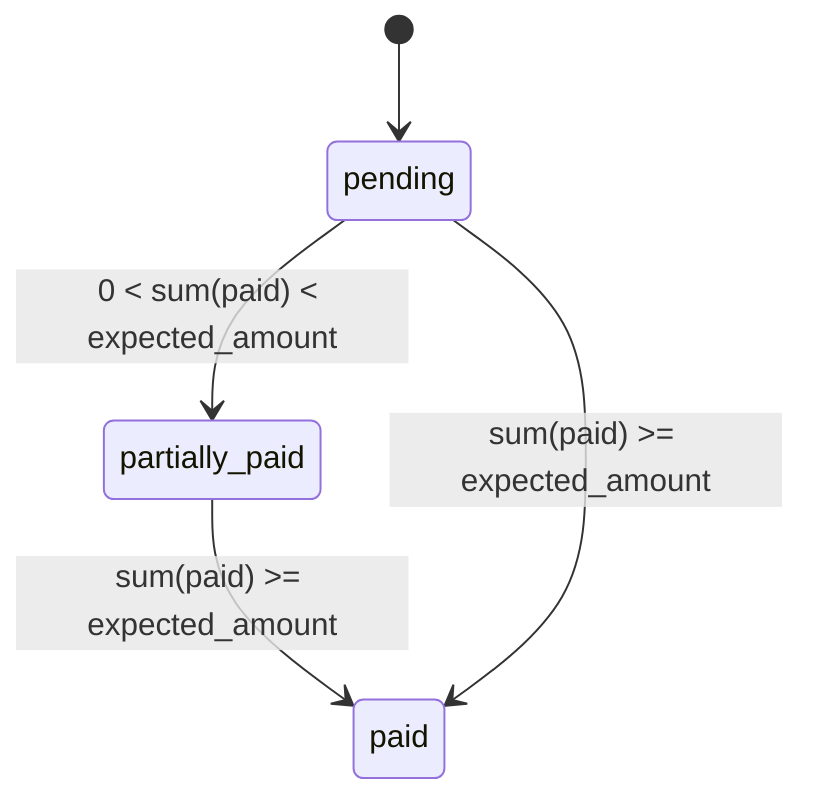

# Phase 1 Data Model: Personal Budget App

Source of truth for column-level detail is [`docs/database/schema.sql`](../../docs/database/schema.sql).
This document maps that schema to the domain entities the API operates on,
plus validation rules and derived values that live in the application layer
(not the database) per the spec's Assumptions.

## Entity Overview

## Entities

### User (`users`)

| Field | Type | Notes |
|---|---|---|
| user_id | UUID (PK) | |
| google_id | string, unique | from verified Google ID token `sub` |
| email | string | from Google profile |
| email_verified | boolean | from Google profile |
| name | string | |
| avatar_url | string | |
| created_at / updated_at | timestamptz | |

### User Settings (`user_settings`, 1:1 with User)

| Field | Type | Validation |
|---|---|---|
| currency | `crc` \| `usd` | default `crc` |
| language | `es` \| `en` | default `es` |
| periods_mode | `at_demand` \| `biweekly` \| `each_month` \| `weekly` \| `range` | default `each_month` |
| periods_start_days | smallint[] | non-empty, each day in `1..31` (`is_valid_period_start_days`) |
| minimum_period_days | smallint | `> 0`; used by `at_demand` mode |

### Period (`periods`)

| Field | Type | Notes |
|---|---|---|
| period_id | UUID (PK) | |
| user_id | UUID (FK → users) | periods are user-level, shared by all of the user's budgets |
| start_date | date | |
| end_date | date, nullable | `NULL` = currently open period |

**Invariants (application-enforced, not DB constraints)**:
- Periods never overlap for a given user.
- At most one open (`end_date IS NULL`) period per user at a time.
- If `periods_start_days` contains a day that doesn't exist in a given month
  (e.g. 31 in February), the period boundary falls back to the last day of
  that month.
- Periods are never created directly through the API; they are derived
  as a side effect of recording a transaction (see Period Lifecycle below).

**Period Lifecycle (state machine, application logic)**:

### Budget (`budgets`)

| Field | Type | Notes |
|---|---|---|
| budget_id | UUID (PK) | |
| name | string | |
| type | `personal` \| `household` \| `travel` \| `vacation` | default `personal` |
| is_deleted | boolean | soft delete; excluded from normal list views |

### User-Budget Membership (`users_budgets`)

| Field | Type | Notes |
|---|---|---|
| user_id, budget_id | composite PK | |
| role | `admin` \| `member` \| `viewer` | default `admin` (creator) |

**Invariant**: a budget must always have at least one member; removing the
last member is rejected by the application layer.

**Role permission matrix**:

| Action | admin | member | viewer |
|---|---|---|---|
| View budget/books/transactions | yes | yes | yes |
| Create/edit books, transactions | yes | yes | no |
| Manage members/roles | yes | no | no |
| Delete (soft) the budget | yes | no | no |

### Book (`books`)

| Field | Type | Notes |
|---|---|---|
| book_id | integer (PK) | |
| name | string | |
| budget_id | UUID (FK → budgets) | |
| type | `account` \| `expense` \| `saving` \| `debt` \| `investment` | immutable after creation |
| is_deleted | boolean | soft delete |

Exactly one of the following detail rows exists per book, matching `type`
(`account` → `account_book_details`, `expense` → `expense_book_details`,
`saving` → `saving_book_details`, `debt` → `debt_book_details`;
`investment` has no detail table today). Enforced by the application layer at
create time (schema does not enforce this cross-table invariant).

### Account Book Details (`account_book_details`)

| Field | Type | Validation |
|---|---|---|
| book_id | PK/FK → books | |
| card_last_digits | string(4) | exactly 4 digits |

### Expense Book Details (`expense_book_details`)

| Field | Type | Validation |
|---|---|---|
| book_id | PK/FK → books | |
| estimated_amount | decimal(18,2) | `>= 0` |
| adjusted_amount | decimal(18,2), nullable | `>= 0` when present; `NULL` = use `estimated_amount` |
| control_level | `fixed` \| `adjustable` \| `easy_adjustable` | default `fixed` |
| priority_level | `needs` \| `wants` | default `needs` |
| parent_expense_id | integer (FK → books) | for grouping sub-expenses |
| is_subscription | boolean | default `false` |

**Derived value**: `active_target_amount = adjusted_amount ?? estimated_amount`.
**Derived value**: `actual_spent(period) = SUM(transactions.amount WHERE take_in_book_id = book_id AND transaction period = period)` — never stored.

### Saving Book Details (`saving_book_details`)

| Field | Type | Validation |
|---|---|---|
| book_id | PK/FK → books | |
| account_book_id | integer (FK → books) | linked account |
| goal_amount | decimal(18,2) | `>= 0` |
| saving_mode | `to_date` \| `to_amount` \| `each_month` | |
| period_amount | decimal(18,2) | `>= 0`; for `to_date` this is computed, not user-entered |
| priority | smallint | `> 0`; lower value = reduced first when funds are reallocated |
| is_emergency_savings | boolean | default `false` |
| start_date / goal_date | date | `goal_date >= start_date` |
| continue_if_fulfilled | boolean | |
| initial_balance | decimal(18,2) | `>= 0` |

**Derived values** (never stored): `accumulated_saved = initial_balance + SUM(transactions.amount WHERE take_in_book_id = book_id AND type = 'saving')`; `contributions_count = COUNT(matching transactions)`; for `saving_mode = to_date`, `period_amount = (goal_amount - accumulated_saved) / remaining_periods_until(goal_date)`.

### Debt Book Details (`debt_book_details`)

| Field | Type | Validation |
|---|---|---|
| book_id | PK/FK → books | |
| original_debt_amount | decimal(18,2) | `>= 0` |
| installments | integer | `> 0` |
| interest_rate | decimal(18,2) | `>= 0` |

### Book Scheduling (`book_scheduling`, 0:1 per book)

| Field | Type | Validation |
|---|---|---|
| book_id | PK/FK → books | |
| frequency | `each_week` \| `each_two_weeks` \| `each_month` \| `each_year` | |
| start_date / end_date | date, end nullable | `end_date >= start_date` when present |
| take_from_book_id | integer (FK → books) | source book for generated transactions |
| automatic_transaction | boolean | if `true`, a transaction is generated automatically on each scheduled date |

**Behavior**: schedules with `end_date` in the past generate no further
transactions; each occurrence generates exactly one transaction (no
duplicates, no gaps) within the active date range.

### Transaction (`transactions`)

| Field | Type | Validation |
|---|---|---|
| transaction_id | UUID (PK) | |
| amount | decimal(18,2) | `>= 0` |
| currency | `crc` \| `usd` | |
| user_currency_amount | decimal(18,2) | `>= 0`; `amount` converted to the recording user's settings currency |
| exchange_rate | decimal(18,6) | `> 0` |
| comments | string(528), nullable | |
| type | `movement` \| `expense` \| `saving` \| `income` \| `investment` \| `debt_payment` \| `account_initial_balance` | |
| date | timestamptz | |
| take_in_book_id | integer (FK → books), nullable | destination book |
| take_from_book_id | integer (FK → books), nullable | source book |
| reference_number / authorization_number / merchant | string, nullable | |

**Invariant**: at least one of `take_in_book_id` / `take_from_book_id` must be
present (matches `chk_transactions_at_least_one_book`).
**Invariant**: recording a transaction is what triggers period evaluation (see
Period Lifecycle) — a period is created first if none exists yet.

### Expense Occurrence (`expense_occurrences`)

| Field | Type | Validation |
|---|---|---|
| occurrence_id | UUID (PK) | |
| expense_book_id | integer (FK → expense_book_details) | |
| period_id | UUID (FK → periods) | |
| due_date | date | |
| expected_amount | decimal(18,2) | `>= 0` |
| transaction_id | UUID (FK → transactions), nullable | legacy single-link column; status derivation instead sums **all** transactions against `expense_book_id` within the occurrence's period (per spec FR-016/FR-017) |

**Invariant**: at most one occurrence per `(expense_book_id, period_id)`.

**Derived status (never stored)**:

Where `expected_amount` used for the comparison is the occurrence's own
`expected_amount` (snapshotted per period from the expense's
`active_target_amount` at generation time), and `sum(paid)` is the sum of
`transactions.amount` for `type = 'expense'` and `take_in_book_id =
expense_book_id` whose `date` falls within the occurrence's period bounds. An
occurrence whose period has already closed remains in whatever status its
transaction sum implies (it does not roll over, per the spec's Edge Cases).

## Cross-Entity Validation Rules Owned by the Application Layer

These are documented here because the schema intentionally does not enforce
them (per the spec's Assumptions), so the corresponding use-cases must:

1. Verify an expense occurrence's `expense_book_id` and `period_id` belong to
   the same user (via the book's budget → user membership, and the period's
   `user_id`).
2. Reject removing the last remaining member of a budget.
3. Reject creating more than one detail row per book, and reject a detail row
   whose type doesn't match `books.type`.
4. Enforce the non-overlapping / single-open-period invariant on every period
   creation.
